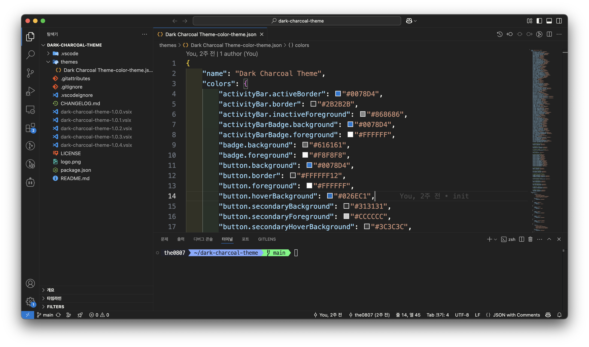

## 🪨 Dark Charcoal Theme  

**Dark Charcoal Theme** is a sleek and modern dark theme designed to enhance readability and improve the overall development experience. This theme also includes recommended extensions and a terminal font setup for an optimized coding environment.

---

### 🎨 **Theme Features**  
- Comfortable contrast to reduce eye strain  
- Well-balanced color palette for maximum readability  
- Optimized for various programming languages and UI elements  

---

### 🚀 **How to Use**  
1. Install **[Dark Charcoal Theme](https://marketplace.visualstudio.com/items?itemName=the0807.dark-charcoal-theme)**
2. Open the command palette (`Ctrl or cmd + Shift + P`) → Select `Preferences: Color Theme` → Choose **"Dark Charcoal Theme"**  
3. *(Optional)* If the **D2Coding font** does not apply correctly:  
   - Open settings (`Ctrl + ,`) → Search for `terminal.integrated.fontFamily` and ensure it is set to `"D2Coding"`  
   - If the font is not installed, follow the installation steps below and restart VS Code  

---

### 🔌 **Recommended Extensions (Automatically Installed)**  
This theme is best experienced with the following extensions. They will be automatically installed upon installation of this theme but can be individually enabled/disabled as needed.  

| **Extension** | **Description** |  
|--------------|---------------|  
| [**Material Icon Theme**](https://marketplace.visualstudio.com/items?itemName=PKief.material-icon-theme) | A modern and clean icon theme for better file and folder visualization. |  
| [**Indent Rainbow**](https://marketplace.visualstudio.com/items?itemName=oderwat.indent-rainbow) | Highlights indentation levels with different colors for improved readability. |  
| [**TXT Syntax**](https://marketplace.visualstudio.com/items?itemName=xshrim.txt-syntax) | Adds syntax highlighting support for plain text (`.txt`) files. |  
| [**Path Intellisense**](https://marketplace.visualstudio.com/items?itemName=christian-kohler.path-intellisense) | Auto-completes filenames and paths in your code for faster development. |  
| [**Markdown All in One**](https://marketplace.visualstudio.com/items?itemName=yzhang.markdown-all-in-one) | A comprehensive Markdown toolkit with shortcuts, live preview, table of contents, and more. |  
| [**Git Graph**](https://marketplace.visualstudio.com/items?itemName=mhutchie.git-graph) | View a Git Graph of your repository, and perform Git actions from the graph. |  
| [**Todo Tree**](https://marketplace.visualstudio.com/items?itemName=Gruntfuggly.todo-tree) | Highlights TODOs, FIXMEs, and other comment tags in your code with customizable colors and icons. |  

---

### 🔤 **Terminal Font Setup (D2CodingLigature Nerd Font)**  
Dark Charcoal Theme sets **D2CodingLigature Nerd Font** as the default terminal font. **You must install the font manually for it to work correctly.**  

#### 📥 **How to Install D2CodingLigature Nerd Font**  
1. Download the latest version of D2Coding Nerd Font from the [official GitHub repository](https://github.com/ryanoasis/nerd-fonts/tree/master/patched-fonts/D2Coding).  
2. Install the font based on your operating system:  
   - **Windows**: Open the `.ttf` file and click "Install"  
   - **Mac**: Open the `.ttf` file and click "Install"  
   - **Linux**: Move the `.ttf` file to `~/.fonts/` or `/usr/share/fonts/` and run `fc-cache -f -v`  
3. Restart VS Code to apply the font to the terminal.  

---

### 💡 **Feedback & Contributions**  
We welcome feedback and contributions to improve the theme! Feel free to report issues or suggest improvements on our [GitHub repository](https://github.com/the0807/Dark-Charcoal-Theme).  

🚀 Enjoy a more comfortable and efficient coding experience with **Dark Charcoal Theme**!
